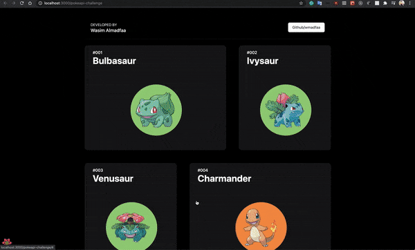

# [pokeapi-challenge](http://wmadfaa.github.io/pokeapi-challenge)

## Task description:

By using the PokeAPI (https://pokeapi.co/) create a Pokedex of all existing Pokemon. The App should list all Pokemon and offer the possibility to view Details.
The Details-Page should display:

- picture
- name
- abilities
- type
- order-number
- stats
- possible evolutions
- moves

[DEMO](http://wmadfaa.github.io/pokeapi-challenge)

## libs

react-query _fetching, caching and updating asynchronous data_
react-async-hook _for async operations inside the components_
framer-motion _mostly for layout animations_
react-spring _for creating the interactive pokemon img_
tailwind _CSS util framework_

## testing

react-testing-library _testing ui components_
Mock Service Worker (msw) _api requests mocking_
testing-library-hooks _test custom hooks_

## done

- [x] JavaScript Framework: Angular, React or Vue
- [x] Style Framework: any (e.g. Bootstrap or Material), but mandatory
- [x] Typescript
- [x] PokeAPI: https://pokeapi.co/
- [x] a minimum of 3 meaningful Unit Tests

## todo

- [ ] improve the project files structure
- [ ] add routes to the pokemon-diatels section
- [ ] show loading screen on page loading
- [ ] add error handling
